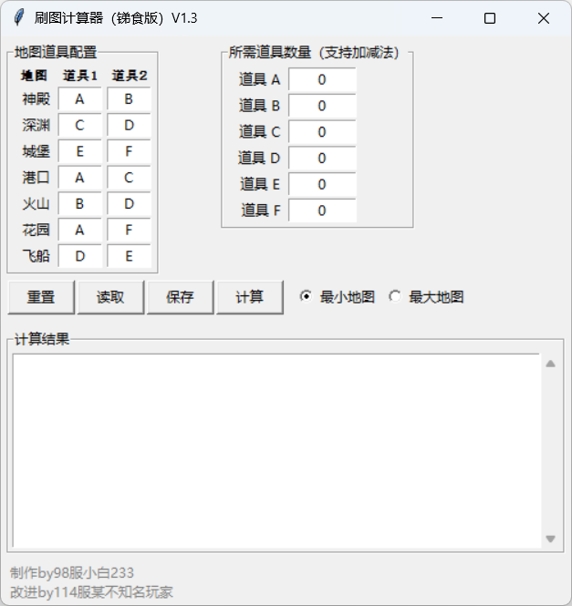

解决了这样的一个问题：在一个游戏里，一共有八张地图，每个地图都产出两个道具，一局产出两个不同的道具，不同地图有可能产出相同的道具，一共有六个道具，分别叫ABCDEF，领取任务需要不同的数量的不同道具，请问怎么用才能用最少的次数领取任务奖励。
因为每个地图刷一次只会产出两个不同的道具，我需要的结果是告诉我分别刷不同的地图多少次，比如99个A，和2个E、2个F，我就需要刷99次地图1，2次地图6，这样才能达成目标
八个地图的道具产出情况如下：
地图1：A、B
地图2：A、C
地图3：B、D
地图4：C、E
地图5：D、F
地图6：E、F
地图7：A、D
地图8：B、C
每个道具所需的数量：
A: 3
B: 3
C: 3
D: 3
E: 2
F: 2

# 更新日志：

## V1.3
- **计算逻辑重构，修复原版计算逻辑，恢复对最小地图和最大地图两种计算模式的支持**
- **UI设计重构，改用`LabelFrame`分组布局（地图道具配置、所需道具、计算结果），增加表头（地图/道具1/道具2），输入框居中对齐，新增窗口最小尺寸限制，结果区域支持垂直拉伸自适应，大幅优化显示效果和使用体验**
- **重置/保存确认**：重置和保存操作前增加确认弹窗，防止误操作
- **保存/读取升级**：保存文件新增`NEEDS:`和`METHOD:`标记，支持保存和恢复计算模式（最小/最大地图）
- **输入/输出升级**：道具数量输入允许括号`()`和空格，`eval`后校验结果为数字类型，“计算结果”文本框默认`state="disabled"`，防止用户误编辑
## V1.2
- **新增功能**：道具数量输入支持减法运算
  - 现在可以在道具数量输入框中使用加减混合表达式（如"10+5-3"）
  - 支持更复杂的数量计算需求
- **增强验证**：改进输入表达式验证机制
  - 检查表达式格式，防止连续运算符
  - 自动处理负数结果（设为0）
  - 提供更详细的错误提示信息
- **界面优化**：更新提示文本，明确说明支持加减法

## V1.1
- 优化界面布局，确保制作信息栏文本左对齐
- 改进整体组件对齐方式，提升视觉一致性
- 实装重置、保存、加载功能
- 增强错误处理和用户提示
- 改进结果显示区域，支持多行显示和滚动

## V1.0
- 初始版本发布
- 基本计算功能实现
- 支持最小地图和最大地图两种计算模式
